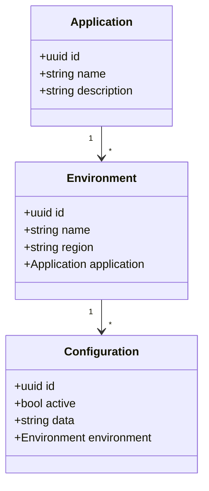

# Sinch Frontend Assignment

Your assignment is to develop a web application based on [React library](https://reactjs.org/) to manage configuration for Sinch applications.
We have got 2 environments setup for the API and the swagger documents can be found at:
* [Development](https://config-mgmt-dev.fly.dev/swagger)
* [Production](https://config-mgmt.fly.dev/swagger)

##  Brief Description about the APIs
The API endpoints exposed by the service and can be mainly divided into 3 categories.

* Applications - These APIs expose the details of services available to store and retrieve configurations for. The APIs cover the basic CRUD operations.

* Environments - These are the different instances of the applications mentioned above. Each environment per application needs to have unique configurations set. Example for environments is Development, QA, Staging and Production.

* Configurations - These APIs let you search for configurations for each application environment. Then you can use the ID of the configuration to get the details of it. When a new configuration is created its created as an inactive entity. Only one active configuration is available for a given application environment combination. When you call the activate API all other configurations available for that environment combination become inactive.

**Note:** The frontend is expected to handle intermittent errors that can happen in the server in a graceful manner. The development environment has been setup so that it fairly stable but the production environment is setup so that ~50% of the requests produces internal server error. When the solution is evaluated the web application should be able to handle these errors.

## Wireframe of the UI

Following wireframe can be used as a starting point for the web application design, but feel free to do any changers/improvements that you think would make the application intuitive and standout. 

