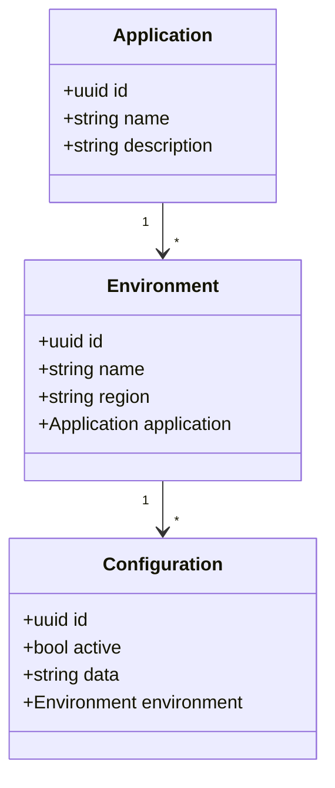

# Sinch Frontend Assignment

Your assignment is to develop a web application based on [React library](https://reactjs.org/) to manage configuration for Sinch applications. The code for API to your frontend is contained in this repository. To start the service on your local development machine, you can clone this repository and build the docker image using the following command.

```
docker build -t sinch.config.mgmt -f Dockerfile .
```

Once the build is completed run the following command to start the container:

```
docker run --name sinch.config.mgmt -e Sinch_Config_Mgmt_MockErrorRate='0.2' -p 8080:8080 -d sinch.config.mgmt 
```

If you are using a Mac computer with Apple silicon:

```
docker build --platform linux/amd64 -t sinch.config.mgmt -f Dockerfile .
docker run --platform linux/amd64 --name sinch.config.mgmt -e Sinch_Config_Mgmt_MockErrorRate='0.2' -p 8080:8080 -d sinch.config.mgmt
```

Alternativly you can download the perbuilt binary files to match your development machines operating system from the GitHub releases [page](https://github.com/sinch/Sinch-Frontend-Assignment/releases/).

Once the server is up and running you can open up the Swagger documentation at [http://localhost:8080/swagger](http://localhost:8080/swagger).

##  Brief Description about the APIs
The API endpoints exposed by the service and can be mainly divided into 3 categories.

* Applications - These APIs expose the details of services available to store and retrieve configurations for. The APIs cover the basic CRUD operations.

* Environments - These are the different instances of the applications mentioned above. Each environment per application needs to have unique configurations set. Example for environments is Development, QA, Staging and Production.

* Configurations - These APIs let you search for configurations for each application environment. Then you can use the ID of the configuration to get the details of it. When a new configuration is created its created as an inactive entity. Only one active configuration is available for a given application environment combination. When you call the activate API all other configurations available for that environment combination become inactive.



**Note:** The frontend is expected to handle intermittent errors that can happen in the server in a graceful manner. The server implementation provided has a feature to mock such errors. The error rate can be changed by setting the environment variable `Sinch_Config_Mgmt_MockErrorRate`. The value for this should be between 0 and 1. For example a value of 0.5 results in ~50% of the requests produces internal server error.  During development you can set this to 0, but when the solution is evaluated the web application should be able to handle these errors.

## Wireframe of the UI

Following wireframe can be used as a starting point for the web application design, but feel free to do any changers/improvements that you think would make the application intuitive and standout. 


